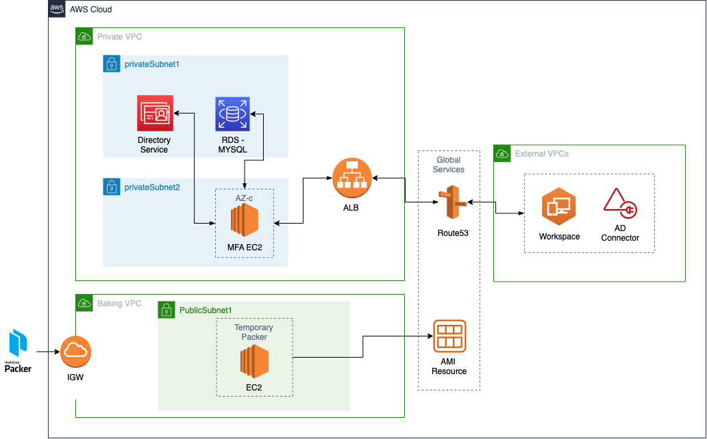

# AWS Workspace MFA - PrivacyIDEA & FreeRADIUS

## Requirements:

- [Packer](https://learn.hashicorp.com/tutorials/packer/get-started-install-cli)
- [Terraform](https://www.terraform.io/)

Run `packer/deploy.sh` to deploy to AWS AMI.  
The actual deployment is done in `terraform/deploy.sh`.

## Diagram:



This documentation will be covering how to set up AWS Workspace MFA (Multi-Factor authentication) in a closed environment

## Explanation

The diagram shows the development and deployment of the MFA server.

Stack Used:

- CentOS 7 Image
- PrivacyIDEA
- Packer by HashiCorp
- Terraform
- RDS MySQL

### FreeRADIUS

For AWS Workspace, the only way to have MFA is via [RADIUS protocol](https://aws.amazon.com/blogs/aws/multi-factor-auth-for-workspaces/). There is an official [blogpost](https://aws.amazon.com/blogs/desktop-and-application-streaming/integrating-freeradius-mfa-with-amazon-workspaces/) by AWS on how to set up a linOTP server with RADIUS, however I noticed that linOTP is not well maintained and the documentation is extremely poor, as such I have came out with a custom solution of using another open source solution, PrivacyIDEA, a modular authentication system that is written in python, uses flask as web framework and an SQL database as datastore with plenty of user customisation.

The MFA server which is running on a `t2.medium` ec2 on-demand instance consist of:

- PrivacyIDEA portal and server
- FreeRADIUS server

#### PrivacyIDEA

PrivacyIDEA acts as the security MFA interface to communicate between the RADIUS server and the active directories.

The PrivacyIDEA portal has a user self-serve portal and an admin portal.

The user self-serve portal is used for users to enrol token for themselves to scan the QR code while the admin portal has access control ,realms, configuration, users, resolvers etc.

#### FreeRADIUS Server

RADIUS (Remote Authentication Dial-In User Service) is a client-server protocol and software that enables remote access servers to communicate with a central server to authenticate dial-in users and authorise their access to the requested system or service.

FreeRADIUS is an open source implementation of RADIUS, an IETF protocol for AAA (Authorisation, Authentication, and Accounting).

We are primarily using Perl as an authentication module as it is compatible with both PrivacyIDEA and FreeRADIUS.

This service is primarily on the backend, there is no interaction with the user.

### Development

The development of the MFA server is written using Packer by Hashicorp . It loads a bash script and creates a temporary EC2 with required credentials in a baking VPC, the core idea is to download and install (configure excluded) the required packages and burn it into an AMI resource which can then be deployed into a closed environment.

#### Things to note

- Everything has deletion protection in place, Terraform will not be able to terminate the instances once created, developer has to manually log into the console to remove
- Manual configuration is still needed for every launched of baked AMI as it requires console access to secrets manager to access the encryption key.

## Setup:

This setup explains the setting up of MFA server from the development of Packer to the deployment of the actual environment.

Ensure you have Packer and Terraform installed on your local computer.

### Pre-requiste:

Please ensure that in AWS Secrets Manager you have a secret which ties with `terraform/rds.tf` credentials with “Key/Value pairs”

Inside you will have to have the following values:

| Secret Key   | Secret Value | Comments (Not to be placed inside Secrets Manager)                                                           |     |     |
| ------------ | ------------ | ------------------------------------------------------------------------------------------------------------ | --- | --- |
| SQL_username | \*\*\*\*     | Your desired RDS MYSQL database username. Terraform will retrieve the value here to create the RDS database. |     |     |
| SQL_password | \*\*\*\*     | Your desired RDS MYSQL database password. Terraform will retrieve the value here to create the RDS database. |     |     |
|              |              |                                                                                                              |     |     |

### Packer

I have named all the MFA server Packer AMI as `centos-mfa-radius-ami-${local.timestamp}` for Terraform ease of deployment.

### Terraform

To deploy the AMI, you will have to run the `terraform/deploy.sh` script.

The terraform files are located in `terraform/core/infrastructure/...`

### Infrastruture

Infrastructure

The whole MFA solutions requires a few AWS components, namely:

- Application Load Balancer (OPTIONAL)
- Route53 A Records (OPTIONAL)
- EC2 (t2.medium)
- RDS MYSQL (db.t3.small - mysql==8.0.28)

Important Security Group Ports:
Port 3306 (Database), port 1812 (UDP - RADIUS), port 443 (HTTPS)

## MFA Server

The actual bash script for installing all the required packages are located in `packer/startup.sh`

The startup.sh script installs the 2 main components, PrivacyIDEA and FreeRADIUS

### PrivacyIDEA

There is an official documentation by PrivacyIDEA [here](https://privacyidea.readthedocs.io/en/latest/installation/centos.html), however it is noted that at this time of writing (v3.7.1) the guide did not update for Python3, instead they are using Python2. Thus I have made some modifications to the codes and environment like converting the original local SQL database to an RDS MYSQL instance.

It is important to note that the executable of PrivacyIDEA on the CLI is known as pi-manage which can only be access via a user privacyidea and the developer must activate the python3 virtual environment.

```shell
# To access pi-manage to execute CLI PrivacyIDEA commands
su - privacyidea
source /opt/privacyidea/bin/activate

pi-manage xxx
```

To note, on the very first initialisation of the database, the developer has to manually enter the actual deployed EC2 via SSH/SSM and access the PrivacyIDEA configuration file `/etc/privacyidea/pi.cfg` to add the `PEPPER`, `SECRET KEY`,`SQLALCHEMY_DATABASE_URI` environment. These variables string can be generated by using a urandom function found in the startup.sh script. Do note the variables values down into the AWS Secrets Manager as losing this encryption key will cause a catastrophe.

Only on first setting up the MFA server, you will have to run the following commands using pi-manage

```shell
###################
## On First load ##
###################
pi-manage create_enckey                                                 # encryption key for the database
pi-manage create_audit_keys                                             # key for verification of audit log entries
pi-manage createdb                                                      # create the database structure
pi-manage db stamp head -d /opt/privacyidea/lib/privacyidea/migrations/ # stamp the db
pi-manage admin add admin --password password # Note to add to AWS Secrets Manager
```

Please note the admin in this case is the superadmin which will be used to set up the MFA policies and configurations. The password will not be able to change on the UI, so please note it down on AWS Secrets Manager.

Do a `systemctl restart httpd` for mod_wsgi apache to take effect.

### FreeRADIUS

Something to take note here is that in online tutorials, FreeRADIUS is commonly known to be found in `/etc/freeradius` or `/etc/freeRADIUS` or `/etc/FreeRadius`. That naming convention is only available in Ubuntu systems, for CentOS, the equivalent is known as `/etc/raddb`

The only thing that requires configuration will be in `/etc/raddb/clients.conf`

```
# FreeRADIUS identifies each client via their secret
# Please note for the ad connectors, put the password in single quotes.
# and that each password SHOULD NOT BE IDENTICAL

# localhost for testing
client localhost {
ipaddr = 127.0.0.1
secret = password
netmask = 32
}
# AD Connector, insert AD VPC CIDR Range
client microsoftad{
ipaddr  = 100.1.1.0
netmask = 24
secret  = 'password2'
}
```

Finally do a `systemctl restart radiusd` for freeRADIUS to take effect

### Debugging

To debug connection to freeRADIUS, you must first stop the service and launch it in debug mode then send a request to view the logs live.

```shell
service radiusd stop
radiusd -X # Run debug mode. NOTE:Run this on a separate terminal or run as detach mode.
echo "User-Name=admin, User-Password=password" | radclient -sx localhost auth password
systemctl restart radiusd
```

To test the PrivacyIDEA token enrolment, you can either do it via the PrivacyIDEA UI or running a CLI command

```shell
radtest USERNAME MFACODE PRIVATERADIUSIP:1812 10 localhost
```

### Setting Up PrivacyIDEA

Once the configuration for MFA server is done, log into the workspace and head to the private IP of your MFA server, log in using the superadmin username and password that was set previously using `pi-manage`.

#### LDAP

Head to `Config > Users > ldapresolver` on the UI

```
Resolver name: anyUserResolver
Server URI: ldap://<IP of directory DNS>,ldap://<IP of directory DNS>
STARTTLS: uncheck
Base DN: OU,DC, etc << base on your AD config
Bind DN: CN,OU,DC, etc << base on your AD config
Bind Password:<Admin password>
Scope: SUBTREE
Bind Type: Simple
```

Then click Preset Active Directory, leave the rest as default. Click Test LDAP Resolver and finally Save Resolver.

#### Realms

Head to `Config > Realms` on the UI.

Check anyUserResolver and call the realm as per your `/etc/privacyidea/rlm_perl.ini` and priority as 1.

To test if everything is working correctly click on `Users` , select `Realm` from your `/etc/privacyidea/rlm_perl.ini` and select a user, click on Enroll new token , select `TOTP` and check the box Generate OTP Key on server. Leave the PIN box empty as we do not want them to key in PINOTP but rather just OTP. A QR code should come out, scan using an authentication app like Google Authenticator.

Select the OATH0000XXXX, you can key in the OTP and click Test OTP only. If everything is working fine, it will show a green success dialog.

Note:

- Keep TOPT as SHA-1, by default it is already SHA-1

#### Policies

Head to `Config > Policies` on the UI.

You are able to set your own policies for `scope:user` coupled with actions found in the Action tab.

#### AWS Directory Service

Once everything is set up and running, you will have to access the AWS Directory Service and select the corresponding directories. Click on enable `Enable multi-factor authentication (MFA)` and proceed to fill up the blanks.

RADIUS server: Private IP address of the MFA Server
Port: 1812
Shared Secret Code: `The password you set in /etc/raddb/clients.conf`
Protocol:PAP
Server timeout: 30
Max RADIUS request retries: 4

To Note:

- Enabling the MFA will prevent you from accessing the workspace if you do not have the 2FA token, instead what you can do is log in before hand and enable it such that you are still able to add yourself in or log in via another AD Connector without the MFA enabled
- Disabling the MFA on the AWS Directory Service will not impact any saved settings

## References

- https://privacyidea.readthedocs.io/en/latest/installation/centos.html
- https://www.privacyidea.org/two-factor-authentication-with-otp-on-centos-7/
- https://www.howtoforge.com/two-factor-authentication-with-otp-using-privacyidea-and-freeradius-on-centos
- https://privacyidea.readthedocs.io/en/latest/application_plugins/rlm_perl.html
